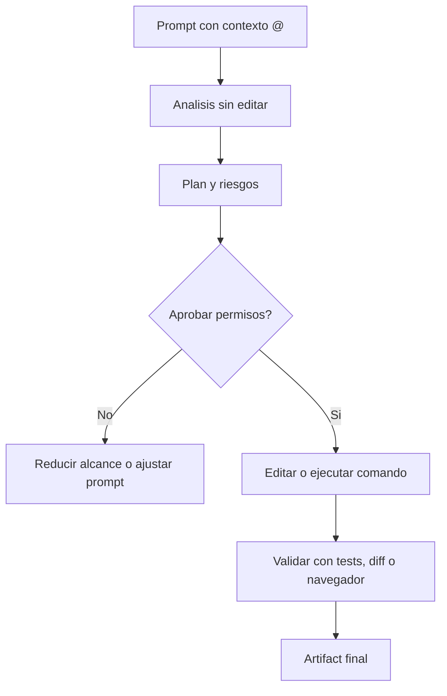

# Guia tecnica del codelab Antigravity CLI

Esta guia complementa el codelab principal con informacion operativa, ejercicios reproducibles y archivos de ejemplo para probar herramientas, permisos, contexto local, rules, skills y MCP.

## Objetivo del taller

Al terminar el codelab, la persona participante debe poder:

- Instalar y autenticar Antigravity CLI con el comando `agy`.
- Usar la TUI interactiva, comandos de barra y atajos esenciales.
- Actualizar la CLI, revisar el changelog y listar modelos disponibles.
- Cargar contexto local con referencias `@archivo` y `@directorio`.
- Entender cuando el agente pide permisos para leer, escribir o ejecutar comandos.
- Configurar reglas `allow`, `ask` y `deny` en `settings.json`.
- Crear customizaciones locales con `.agents/AGENTS.md` y `.agents/skills/`.
- Probar herramientas web, MCP, rules y skills en un entorno controlado.
- Pedir planes, diffs, validaciones y artifacts antes de aceptar cambios.

## Mapa de modulos del codelab

| Modulo | Archivo | Enfoque |
| --- | --- | --- |
| Antigravity CLI | `cli.html` | Instalacion, autenticacion, TUI, contexto, permisos, MCP, rules, skills y ejercicios practicos. |
| Antigravity 2.0 | `antigravity-20.html` | Conceptos de plataforma, agentes coordinados, artifacts, browser validation, plugins y SDK. |
| Temas Avanzados | `advanced-topics.html` | Dynamic Subagents & Shared Agent Harness, Isolated Git Worktree Mode, Multi-Folder Cross-Repository Project Context, y Non-Blocking Asynchronous Task Queues. |
| Guia tecnica | `docs/index.html` y este markdown | Recursos para instructor, workspace de practica, prompts, permisos y checklist. |

## Recursos oficiales para consultar durante el taller

Las URLs originales del material base son:

- CLI overview: `https://antigravity.google/docs/cli-overview`
- Getting started: `https://antigravity.google/docs/cli-getting-started`
- Installation: `https://antigravity.google/docs/cli-install`
- Tutorial: `https://antigravity.google/docs/cli-tutorial`
- Using the CLI: `https://antigravity.google/docs/cli-using`
- Features: `https://antigravity.google/docs/cli-features`
- Best practices: `https://antigravity.google/docs/cli-best-practices`
- Plugins and Skills: `https://antigravity.google/docs/cli/plugins`
- Conversations: `https://antigravity.google/docs/cli/conversations`
- CLI reference: `https://antigravity.google/docs/cli-reference`
- Troubleshooting: `https://antigravity.google/docs/cli-troubleshooting`

Usa estas paginas para validar comandos exactos antes de impartir el taller, especialmente si cambia la version instalada de `agy`.

Referencia adicional usada para complementar el codelab:

- Antigravity CLI Tutorial Series: `https://medium.com/google-cloud/antigravity-cli-tutorial-series-12b46cfe3bf2`

## Workspace de practica incluido

Se agrego un workspace de ejemplo en:

```text
docs/examples/antigravity-practice/
```

Contiene:

- `src/math.js`: codigo con un bug logico para revisar con `@src/math.js`.
- `src/profile.js`: codigo con validacion debil para discutir mejoras.
- `tests/math.test.js`: prueba minima que falla antes de corregir el bug.
- `package.json`: scripts de prueba sin dependencias externas.
- `settings.permissions.example.json`: copia de referencia de la politica de permisos para cargar desde `/permissions` o desde `~/.gemini/antigravity-cli/settings.json`.
- `.agents/AGENTS.md`: rules locales para el agente.
- `.agents/skills/code-reviewer/SKILL.md`: skill local de revision de codigo.
- `.agents/mcp_config.example.json`: ejemplo de configuracion MCP.

## Preparar el ejercicio

Desde la raiz del repositorio:

```bash
cd antigravity-cli-codelabs/docs/examples/antigravity-practice
agy update
agy changelog
agy models
agy
```

Dentro de `agy`, empieza con una inspeccion sin editar:

```text
Analiza @. y dime que archivos hay, que riesgos ves y que ejercicio recomiendas hacer primero. No edites archivos todavia.
```

## Ejercicios sugeridos

### 0. Modo no interactivo con `-p`

```bash
agy -p "Analiza @src/math.js, encuentra el bug y dime que prueba ejecutarias. No edites archivos."
```

Usa `-p` para consultas rapidas, automatizaciones y scripts. Para ejercicios donde quieres observar permisos, usa la TUI interactiva porque muestra mejor el panel de revision.

### 1. Contexto local con `@`

```text
Encuentra el bug en @src/math.js y explica como lo verificarias sin editar todavia.
```

Despues:

```text
Corrige el bug minimo en @src/math.js y ejecuta npm test para comprobarlo.
```

El agente deberia pedir permiso para escribir el archivo y para ejecutar el comando de prueba.

### 2. Revision con una skill local

```text
Usa la skill code-reviewer para revisar @src/profile.js. Prioriza bugs, seguridad y pruebas faltantes.
```

La skill vive en `.agents/skills/code-reviewer/SKILL.md`. Si no aparece activa, abre `/skills` y recarga o verifica que la CLI este ejecutandose desde la raiz del workspace de practica.

### 3. Permisos por comando y archivo

Para demostrar permisos de forma observable, primero crea o usa la carpeta `permisos-lab` dentro del workspace de practica:

```bash
mkdir -p permisos-lab/lectura permisos-lab/edicion permisos-lab/bloqueado permisos-lab/scripts
printf "Este archivo debe poder leerse sin pedir permiso.\n" > permisos-lab/lectura/info-publica.txt
printf "Este archivo se puede modificar, pero debe pedir confirmacion.\n" > permisos-lab/edicion/notas.txt
printf "SECRETO-DEMO: este archivo debe quedar bloqueado.\n" > permisos-lab/bloqueado/secreto.txt
printf "console.log('comando seguro ejecutado');\n" > permisos-lab/scripts/comando-seguro.js
```

El workspace incluido ya trae esos archivos creados. Para el taller, usa `/permissions` como forma principal de cargar reglas y confirmar el alcance disponible en tu version. Si la version solo ofrece permisos globales, usa `~/.gemini/antigravity-cli/settings.json` durante la practica y borra o ajusta las reglas al terminar.

Ejemplo de politica conservadora:

```json
{
  "toolPermission": "request-review",
  "enableTerminalSandbox": true,
  "allowNonWorkspaceAccess": false,
  "permissions": {
    "allow": [
      "command(git status)",
      "command(npm test)",
      "read_file(${workspace}/)"
    ],
    "ask": [
      "write_file(${workspace}/)",
      "command(*)"
    ],
    "deny": [
      "command(rm -rf)",
      "read_file(/etc/passwd)",
      "write_file(/)"
    ]
  }
}
```

Adapta `${workspace}` a la ruta real del ejercicio si tu version no soporta variables.

Prompts para validar:

```text
Lee @permisos-lab/lectura/info-publica.txt y resume su contenido.
Lee @permisos-lab/edicion/notas.txt.
Agrega una segunda linea a @permisos-lab/edicion/notas.txt con el texto "Editado por Antigravity".
Lee @permisos-lab/bloqueado/secreto.txt.
Ejecuta node permisos-lab/scripts/comando-seguro.js.
Ejecuta cat permisos-lab/bloqueado/secreto.txt.
```

Resultados esperados: lectura permitida en `lectura`, confirmacion para `edicion`, bloqueo para `bloqueado`, comando seguro permitido y comando indirecto al secreto bloqueado.

### 4. Modo shell con `!`

```text
!pwd
!npm test
```

Compara la experiencia entre ejecutar comandos directos con `!` y pedirle al agente que los ejecute como parte de una tarea.

### 5. Tools web

```text
Busca la documentacion oficial actual de Antigravity CLI y dime si los comandos de instalacion del codelab siguen vigentes. Cita las URLs consultadas.
```

Este ejercicio sirve para mostrar que las herramientas web requieren permisos y que la informacion cambiante debe verificarse.

### 6. MCP

Revisa `.agents/mcp_config.example.json` y conviertelo en `.agents/mcp_config.json` solo si tienes credenciales o servidores reales para probar. El objetivo del taller es entender la estructura sin exponer secretos.

Ejemplo local de Context7:

```bash
mkdir -p .agents
echo '{
    "mcpServers": {
        "context7": {
            "serverURL": "https://mcp.context7.com/mcp"
        }
    }
}' > .agents/mcp_config.json
```

Agregar o actualizar Context7 desde la terminal preservando otros servidores:

```bash
mkdir -p .agents
node -e 'const fs=require("fs"); const file=".agents/mcp_config.json"; const cfg=fs.existsSync(file)?JSON.parse(fs.readFileSync(file,"utf8")):{mcpServers:{}}; cfg.mcpServers ||= {}; cfg.mcpServers.context7={serverURL:"https://mcp.context7.com/mcp"}; fs.writeFileSync(file, JSON.stringify(cfg,null,2)+"\n");'
```

Listar y eliminar servidores:

```bash
node -e 'const cfg=require("./.agents/mcp_config.json"); console.log(Object.keys(cfg.mcpServers || {}).join("\n"));'
node -e 'const fs=require("fs"); const file=".agents/mcp_config.json"; const cfg=JSON.parse(fs.readFileSync(file,"utf8")); delete cfg.mcpServers.context7; fs.writeFileSync(file, JSON.stringify(cfg,null,2)+"\n");'
```

Agregar un MCP local de filesystem:

```bash
node -e 'const fs=require("fs"); const file=".agents/mcp_config.json"; const cfg=fs.existsSync(file)?JSON.parse(fs.readFileSync(file,"utf8")):{mcpServers:{}}; cfg.mcpServers ||= {}; cfg.mcpServers.filesystem={command:"npx",args:["-y","@modelcontextprotocol/server-filesystem","."]}; fs.writeFileSync(file, JSON.stringify(cfg,null,2)+"\n");'
```

GitHub MCP sin Docker, usando servidor remoto:

```json
{
  "mcpServers": {
    "github": {
      "serverURL": "https://api.githubcopilot.com/mcp/",
      "headers": {
        "Authorization": "Bearer TU_TOKEN_DE_GITHUB"
      }
    }
  }
}
```

Reemplaza `TU_TOKEN_DE_GITHUB` solo en tu copia local. No publiques ni commitees el token real.

## Prompts de trabajo recomendados

Usa prompts que separen analisis, plan, ejecucion y validacion:

```text
Analiza @src y @tests.
No edites todavia.
Devuelve: causa probable, archivos afectados, riesgos, plan de 3 pasos y comandos de verificacion.
```

```text
Implementa solo el paso 1 del plan.
Antes de escribir, lista los archivos exactos que cambiaras.
Despues ejecuta la verificacion minima y resume el diff.
```

```text
Genera un artifact final con: objetivo, cambios hechos, pruebas ejecutadas, riesgos pendientes y siguientes pasos.
```

## Manejo de sesiones

- Usa `/new` o `/clear` cuando cambies de objetivo para evitar arrastrar contexto.
- Usa `/context` para revisar archivos cargados antes de pedir cambios.
- Usa `/tasks` para monitorear trabajo largo y `/btw` para preguntas paralelas de solo lectura.
- Usa `/artifact` para revisar planes, walkthroughs y entregables de la sesion.
- Antes de cerrar, pide un resumen final y guardalo en `SESSION_HANDOFF.md`.
- Usa `agy --continue` para retomar la conversacion mas reciente cuando sigues en el mismo entorno.

Prompt desde cero para iniciar con handoff:

```text
Vamos a trabajar con handoff de sesion desde el inicio.
Objetivo de esta sesion: revisar @bug.js, explicar el problema y proponer una correccion minima sin editar todavia.
Durante la sesion, manten una lista de decisiones, archivos relevantes, comandos sugeridos y riesgos.
Cuando te diga "guardar sesion", crea o actualiza SESSION_HANDOFF.md para que pueda cerrar Antigravity y retomar despues.
```

Prompt para guardar la sesion:

```text
Crea o actualiza SESSION_HANDOFF.md con un resumen para retomar esta sesion.
Incluye: objetivo, estado actual, archivos tocados, comandos ejecutados, decisiones tomadas, riesgos pendientes y siguiente accion recomendada.
No inventes resultados: si una prueba no se ejecuto, marcala como pendiente.
```

Prompt para retomar:

```bash
agy --continue
```

O en una conversacion limpia:

```text
Retoma la sesion usando @SESSION_HANDOFF.md.
Primero resume el estado actual en 5 bullets, luego propone el siguiente paso.
No edites archivos hasta que confirme el plan.
```

Ejercicio recomendado:

1. Analiza `@bug.js` sin editar.
2. Crea `SESSION_HANDOFF.md`.
3. Sal con `/exit`.
4. Vuelve con `agy --continue`.
5. Alternativamente, inicia `agy` limpio y retoma con `@SESSION_HANDOFF.md`.

## Checklist de seguridad para permisos

- Mantener `allowNonWorkspaceAccess` en `false` salvo necesidad explicita.
- Preferir `toolPermission: "request-review"` durante talleres.
- Conocer los modos disponibles: `request-review`, `proceed-in-sandbox`, `always-proceed` y `strict`.
- Evitar `--dangerously-skip-permissions` salvo en workspaces desechables y controlados.
- Agregar `allow` solo para comandos repetitivos y de bajo riesgo, como `git status` o `npm test`.
- Mantener `command(*)` en `ask` si no se conoce bien el proyecto.
- Bloquear patrones destructivos como `rm -rf`, escrituras fuera del workspace y lectura de archivos sensibles.
- Revisar diffs con `/diff` antes de aceptar cambios grandes.
- Usar `/permissions` para explicar decisiones de acceso durante la demostracion.

## Problemas comunes y diagnostico

| Sintoma | Causa probable | Accion |
| --- | --- | --- |
| `agy` no existe | El binario no esta en `PATH` | Reabrir terminal, revisar ruta de instalacion o exportar `PATH`. |
| No aparecen skills locales | La CLI se abrio fuera del workspace | Ejecutar `agy` desde `docs/examples/antigravity-practice`. |
| El agente no lee un archivo | Permisos o referencia `@` incorrecta | Verificar ruta, usar `/context` y revisar `/permissions`. |
| Un comando queda bloqueado | Regla `deny` o sandbox | Revisar precedencia `deny > ask > allow`. |
| MCP no carga | Configuracion, credenciales o servidor ausente | Validar `.agents/mcp_config.json`, variables de entorno y logs. |
| Cambios demasiado grandes | Prompt poco acotado | Pedir plan primero y aprobar lotes pequenos. |

## Cheat sheet

| Accion | Comando o prompt |
| --- | --- |
| Iniciar CLI | `agy` |
| Continuar sesion anterior | `agy --continue` |
| Modo no interactivo | `agy -p "Resume @."` |
| Ayuda de CLI | `agy --help` o `agy help` |
| Actualizar CLI | `agy update` |
| Changelog | `agy changelog` o `/changelog` |
| Modelos disponibles | `agy models` |
| Seleccionar modelo | `agy --model "Gemini 3.5 Flash (High)"` |
| Forzar sandbox | `agy --sandbox -p "Ejecuta pwd"` |
| Salir | `/exit`, `/quit` o `Ctrl+D` dos veces |
| Ayuda | `/help` |
| Nueva conversacion | `/new` o `/clear` |
| Guardar handoff | `Crea o actualiza SESSION_HANDOFF.md...` |
| Retomar handoff | `Retoma la sesion usando @SESSION_HANDOFF.md` |
| Configuracion | `/settings` o `/config` |
| Permisos | `/permissions` |
| Contexto cargado | `/context` |
| Diff de cambios | `/diff` |
| Artifacts | `/artifact` |
| Pregunta paralela | `/btw pregunta` |
| Programar tarea | `/schedule tarea` |
| Skills | `/skills` |
| MCP | `/mcp` |
| Ejecutar shell | `!comando` |
| Referenciar archivo | `@src/math.js` |
| Referenciar directorio | `@src/` o `@.` |

## Diagrama de flujo recomendado



## Notas para instructor

- Antes de la sesion, abre `index.html` y confirma que los modulos del codelab cargan correctamente.
- Usa el workspace de practica para evitar escribir archivos en carpetas personales.
- Explica cada solicitud de permiso como parte del aprendizaje, no como una interrupcion.
- Si se trabaja en Windows, reemplaza comandos POSIX por equivalentes de PowerShell cuando corresponda.
- Cierra con una revision de `/diff`, comandos ejecutados y reglas de permisos usadas.
